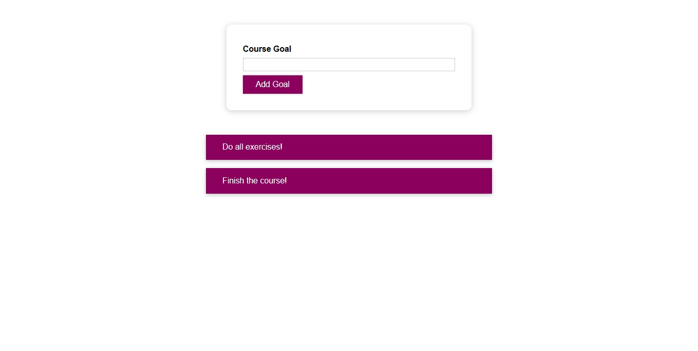

# React Goals Tracker App

This is a simple React.js application that allows users to manage their course goals. Users can add new goals, delete existing goals, and view a list of their current goals.

## Table of Contents

- [React Goals Tracker App](#react-goals-tracker-app)
  - [Table of Contents](#table-of-contents)
  - [Features](#features)
  - [Usage](#usage)
  - [Preview](#preview)
  - [Contributing](#contributing)
  - [Contact Me](#contact-me)

## Features

- Add new goals
- Delete existing goals
- View a list of current goals

## Usage

1. **Clone the repository:**

   ```bash
   git clone https://github.com/Adhamxiii/React-Goals-Tracker.git
   ```

2. **Change into the project directory:**

    ```bash
    cd react-course-goals
    ```

3. **Install the dependencies:**

    ```bash
    npm install
    ```

4. **Start the development server:**

    ```bash
    npm start
    ```

5. **Open the application in your browser:**

    ```bash
    http://localhost:3000
    ```

## Preview



## Contributing

Contributions are welcome! If you find any issues or have suggestions for improvements, please open an issue or submit a pull request.

## Contact Me

If you have any questions or suggestions, feel free to contact me:

- GitHub: [Adham Nasser](https://github.com/Adhamxiii)
- Linkedin: [Adham Nasser](https://www.linkedin.com/in/adhamnasser/)
